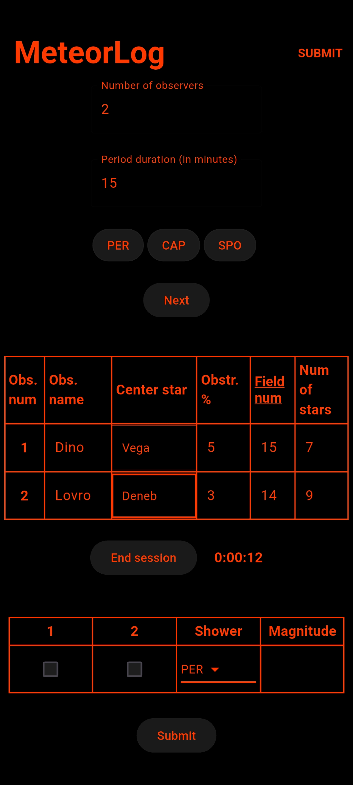

#  MeteorLog

Android app for generating CSV files from visual observations of meteors for submitting to the [IMO website](https://www.imo.net/). Written in Flutter.

## Usage

1. Enter number of the number of the observers, and a desired duration period (you will get notified at the end of each period to start the new session).
2. Select meteor showers you would like to observe, sporadics are included by default.
3. Fill in the table with each observer's viewing specifics (name, star at center of the FOV, estimated view obstruction percentage, a [field number](https://www.imo.net/observations/methods/visual-observation/major/observation/#table1) and its number of stars).
4. When the entire table is filled press "Start session" button.
5. Whenever a meteor is observerd, tick the numbers of the observers that spotted it, select its belonging shower and apparent magnitude. Then click "Submit".
6. When you want to end the session, press "End session" button. Then, all the relevant data will be written inside of the 2 CSV files in the [IMO format](https://www.imo.net/members/imo_observation/upload_observation_help) per observer inside the `Downloads/MeteorLog` folder. CSV files follow the naming convention `YYYYMMDD_HHMM_[observer_name]_[CSV_type].csv`.

After the session is ended, you can start a new one by pressing "Start session" button again. Until the app is fully closed, data from all of the ended sessions will be saved in the same files created at the end of the first session.

App icon credit: <a href="https://www.flaticon.com/free-icons/meteor" title="meteor icons">Meteor icons created by Freepik - Flaticon</a>
